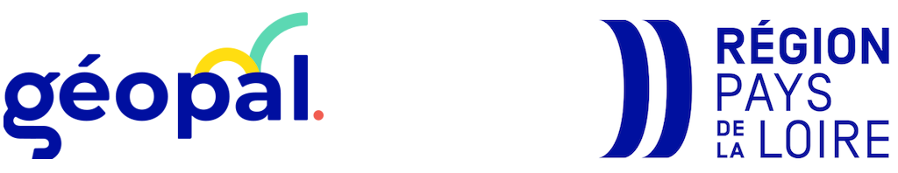

À propos
========

**GeoITV** est un plugin open source pour QGIS, pensé pour faciliter la vie des équipes techniques et des collectivités qui gèrent l’assainissement.

Développé par l’équipe **NAOMIS** dans le cadre du programme **GEOPAL**, avec le soutien de la **Région des Pays de la Loire**.

Contact : `nantes@naomis.fr <mailto:nantes@naomis.fr>`_

.. raw:: html

   

     GeoITV est un projet ouvert à la communauté OpenSource. N’hésitez pas à contribuer ! 
     Voir sur <a href="https://github.com/naomis/qgis-itv-plugin">GitHub</a>
   

Licence : **MIT**