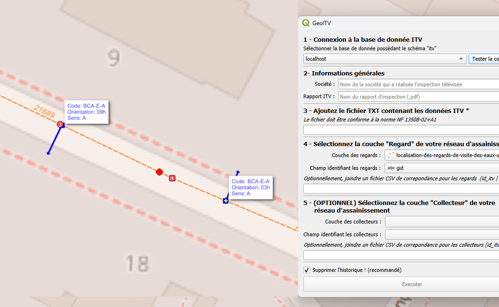

.. GeoITV documentation master file, created by
   sphinx-quickstart on Sun Feb 12 17:11:03 2012.

GeoITV
===============

.. centered:: **GeoITV**

GeoITV, c’est l’outil open source pour intégrer et exploiter les inspections vidéo de réseaux d’assainissement dans QGIS.

À partir d’un fichier **TXT** normé `NF EN 13508-2+A1` :

- déterminez la position précise des défauts observés,
- recensez les regards et branchements,
- visualisez l’emprise de l’inspection et tous les objets détectés lors de l’inspection ITV.

En quelques clics, vos données ITV deviennent exploitables, croisées avec vos couches SIG, pour un suivi technique et patrimonial efficace.

Utilisation et intégration
--------------------------

**Prérequis :**

- Une couche SIG de regards doit être accessible dans QGIS.
- Une couche SIG de collecteurs est facultative.
- Le mode standard **FullPython** ne nécessite pas de base de données.

**Étapes principales :**

1. Sélectionnez le fichier .txt d’inspection ITV à importer (format NF EN 13508-2+A1).
2. Sélectionnez la couche SIG des regards (et éventuellement la couche des collecteurs).
3. Indiquez le champ identifiant unique de la couche (ex : id_regard).
4. (Optionnel) Joignez un fichier de correspondance si les identifiants ITV et SIG diffèrent.
5. Lancez le traitement : les défauts, branchements et emprises sont automatiquement géolocalisés dans des couches mémoire QGIS.

Chaque objet est rattaché à son identifiant SIG lorsque celui-ci est disponible, et l’ensemble des résultats est visualisable directement dans QGIS. Le mode DB legacy est disponible dans la configuration pour les workflows nécessitant PostgreSQL/PostGIS.

Fichier de correspondances : la clé d’une intégration fiable
------------------------------------------------------------

Lors de l’import, il est fréquent que les identifiants utilisés dans les fichiers d’inspection (collecteurs, regards, etc.) diffèrent de ceux de votre SIG (noms, formats, conventions). Le fichier de correspondance permet de faire le lien entre ces deux mondes :

- Il associe chaque identifiant du fichier d’inspection à l’identifiant officiel de votre base SIG.
- Il garantit que les données importées sont correctement reliées à vos objets existants.

Ce fichier doit être au format CSV, avec au minimum :

- une colonne pour l’identifiant du fichier d’inspection
- une colonne pour l’identifiant SIG correspondant

Exemple de structure :

::

   id_reg (ou coll),id_sig
   RG_001,R_000145
   RG_002,R_000278

Script SQL de création du schéma itv
====================================

Le schéma `itv` n'est requis que pour le mode DB legacy. Le mode standard FullPython fonctionne sans base de données.

⚠️ **Prérequis :**

- Disposer d’une base PostgreSQL **version 12 ou supérieure** avec PostGIS **3.4 ou supérieur**.
- Détenir les droits suffisants pour créer l'extension PostGIS, le schéma `itv` et ses objets associés.
- Utiliser des couches SIG dont le SRID est défini. Les calculs métriques sont réalisés en EPSG:2154.

Le script SQL de création du schéma est fourni avec le plugin : 
   ``resources/create_schema_itv.sql``

Ce fichier contient le script SQL complet permettant de créer le schéma `itv` et toutes ses tables, fonctions et objets nécessaires pour l'intégration des inspections ITV dans votre base PostgreSQL/PostGIS.

**Télécharger le script SQL :**

`create_schema_itv.sql <../../../resources/create_schema_itv.sql>`__

.. warning::
   
   L'exécution de ce script peut écraser des données existantes si le schéma `itv` est déjà présent. Vérifiez toujours avant d'exécuter !

.. toctree::
   :maxdepth: 2
   :caption: Sommaire

   a-propos
   installation
   utilisation
   contribution

Indices et tables
=================

* :ref:`genindex`
* :ref:`modindex`
* :ref:`search`

GeoITV est un projet open source, pensé pour et avec la communauté SIG et QGIS. Le code est distribué sous licence **MIT** : vous pouvez l’utiliser, le modifier, le partager et l’améliorer librement. Toutes les contributions sont les bienvenues pour faire avancer l’outil et le rendre utile au plus grand nombre !
